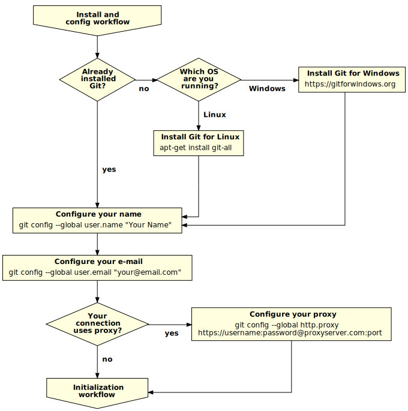
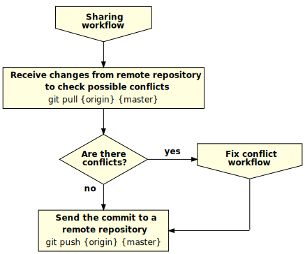
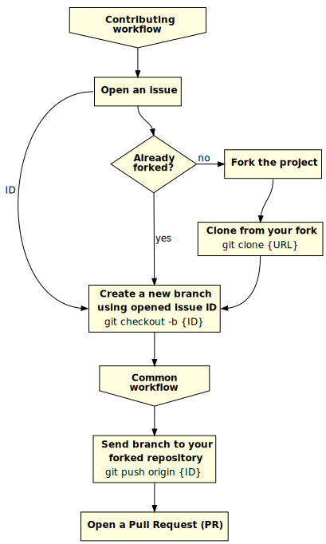

# Git Flowchart

Several `git` flowchart workflows to improve the understanding of `git` commands
and dynamics.

## Install and config workflow

## Initialization workflow

## Common workflow

## Sharing commits workflow

## Contributing workflow

